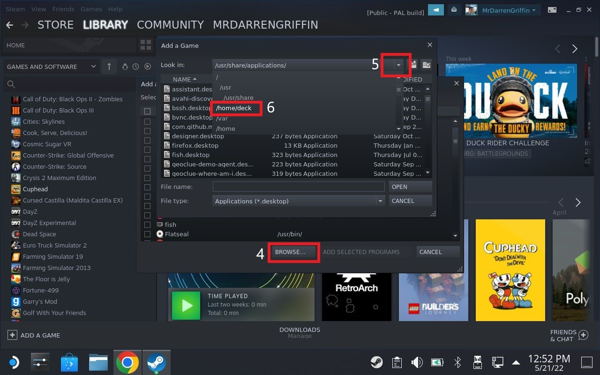
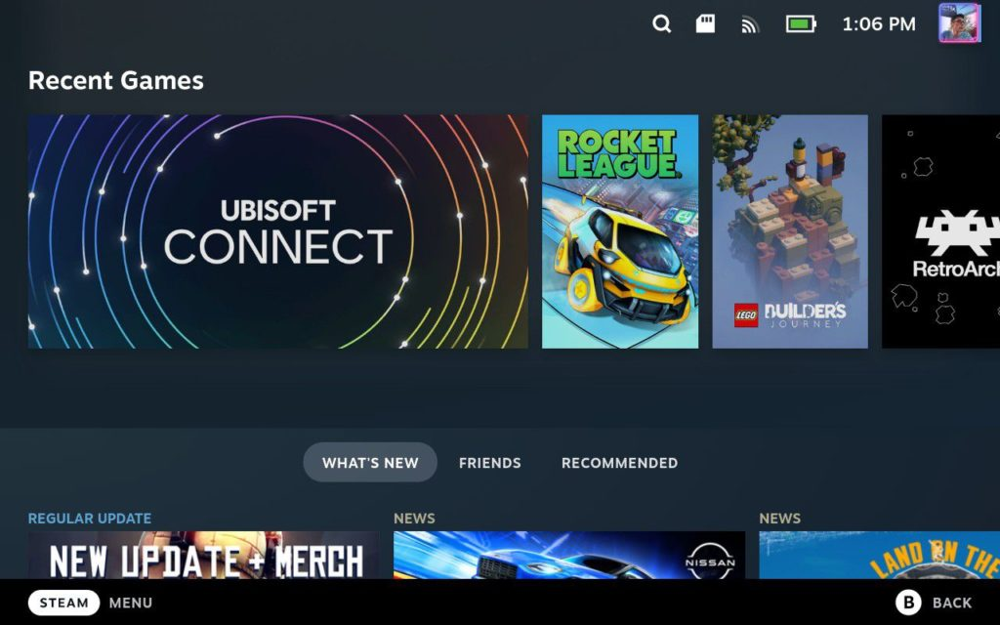

## Steam Method

As you may (or may not) be aware, it was <a href="#the-announcement">announced</a> on Twitter that Trackmania will be coming to Steam and will be available from 2nd February 2023. This is huge news and means that Trackmania will be able to run natively on the Steam Deck without the shenanigans of getting Ubisoft Launcher to work.

It isn't clear how well it will perform or if it will become "Steam Deck Verified". Odds are, the game will perform better than the Ubisoft Launcher method (to be tested) and will have native integration for controller mappings and an overall more stable experience.

In terms of Openplanet, we saw a <a href="https://x.com/OpenplanetDev/status/1617624146606710798" target="_blank">tweet</a> confirming that there shouldn't be any compatibility issues with Steam. However, since OpenPlanet is still primarily made for Windows, you will still need to run it through Proton and install it against your Steam version of Trackmania.

### Steam Listing

If you are browing this article on your PC/Steam Deck, use the widget below to open the Trackmania store page on Steam directly.

<iframe src="https://store.steampowered.com/widget/2225070/" frameborder="0" width="646" height="190"></iframe>

### The announcement

The announcement was made via the official Trackmania Twitter account. No news posts were released on the Ubisoft website other than the previous <a href="https://news.ubisoft.com/en-gb/article/55sfILxGB7ycB3f353CgER/trackmania-races-to-consoles-and-cloud-platforms-in-2023" target="_blank">console update</a> announcement

    

        <h4>Announcement Tweet</h4>
        <blockquote class="twitter-tweet">
Trackmania will launch on Steam on February 2nd, 2023. You can wishlist the game now.
&mdash; Trackmania (@Trackmania) <a href="https://twitter.com/Trackmania/status/1617567972876337177?ref_src=twsrc%5Etfw">January 23, 2023</a></blockquote>
    

    

        <h4>Followup FAQ Tweet</h4>
        <blockquote class="twitter-tweet">
After the announcement of Trackmania on Steam, we received a lot of positive feedbacks: the team thanks you for it.  Today, we are going to answer to the most frequently asked questions in this thread. 🔽
&mdash; Trackmania (@Trackmania) <a href="https://twitter.com/Trackmania/status/1618621206776930304?ref_src=twsrc%5Etfw">January 26, 2023</a></blockquote>
    

## Ubisoft Launcher Method

This method is still working but is considered a last resort if you're unable to get the Steam version (as above) working.

### Before we start

I've heard from people both on Discord and in the comments below that they experience various issues. Although I didn't experience these myself, I have setup a channel dedicated to this on my Discord server where I'm happy to help where and when I can. I'll update this post with any FAQs as we address issues.

If you don't have any issues, feel free to become part of the community and catch my streams on <a href="https://twitch.tv/mrdarrengriffin" target="_blank">https://twitch.tv/mrdarrengriffin</a>

Discord: <a href="https://discord.gg/NxrTg6kNjX" target="_blank">https://discord.gg/NxrTg6kNjX</a>
Channel: Help > #trackmania-steamdeck-support

### Introduction

On 16th July 2021, Valve opened up reservations for their upcoming Steam Deck and after waiting for an agonising 8 months, I finally took delivery of my Steam deck mid-April 2022.

Basking in all it's glory, The only thing on my mind to install first was Trackmania!

If you're like me and want to play Trackmania on your Steam Deck, feel free to follow along as we install and play the game.

## Prerequisites

Before we begin, I want to outline a few things which justifies some odd steps in the installation process:

In my experience, Trackmania is very stable on the Steam Deck and performs really well with very little input latency. However, it is not listed on ProtonDB at all meaning you may experience crashes or performance issues.

This tutorial outlines the steps to install Trackmania from Ubisoft Connect. If you own Trackmania on the Epic Games Launcher, these steps should also work but your mileage may vary.

When in Gaming Mode, we will not see Trackmania as a game title but instead "Ubisoft Connect". Once open, we will be able to launch Trackmania and any other games you may have.

The Steam Deck runs on a modified version of Arch Linux and as it stands, Ubisoft Connect is a Windows only application. However, thanks to Proton, we are able to run Windows applications on Linux 🤯

You will need to put your Steam Deck in Desktop Mode to follow this tutorial (Steam Button > Power > Switch to Desktop). Once in Desktop Mode, open up the browser (Firefox by default) and navigate to this article for a smoother experience.

## Installation

Okay, we've taken care of the nitty gritty so let's get started.

## Ubisoft Connect

First thing's first - we need the Ubisoft Connect launcher. We're going to be downloading the Windows executable and will be utilising Proton to install the application.

Head over to the Ubisoft Website and download Ubisoft Connect.
Alternatively, you can click this link to download the launcher directly: <a href="https://ubi.li/4vxt9" target="_blank">https://ubi.li/4vxt9</a>

Once downloaded, the file should end up in your Downloads folder (/home/deck/Downloads) and should be called something like UbisoftConnectInstaller.exe

## Adding the Ubisoft Connect installer to Steam

We will now need to utilise Proton to run the executable we just downloaded. Guided image instructions are provided below the following steps for you

1. Staying in Desktop Mode, open Steam. It should open and look like the normal Steam desktop client. The font may seem a bit different but that's just Linux for you.
2. Go to Library and at the bottom, tap Add a Game > Add a Non-Steam Game...
3. Click Browse and change the "Look in:" dropdown to /home/deck. Then, find and open the Downloads folder.
4. If you can't see the UbisoftConnectInstaller.exe in the folder, ensure that the "File type:" option is set to "All Files". Once visible, highlight the file, and click Open.
5. The UbisoftConnectInstaller should now be on the "Add a Game" list. Ensure it's checked and click "Add Selected Programs"
6. You should now see UbisoftConnectInstaller.exe as a game in your library. Don't open it yet because nothing will happen 👀

#### Installing the Ubisoft Connect

Once you have the UbisoftConnectLauncher.exe in your library:

1. Right click on the item and go to Properties
2. Go to the Compatibility Tab and check the box beside "Force the use of a specific Steam Play compatibility tool". This should then display a dropdown. In that list, choose the latest version under "Proton Experimental". In my instance, the latest version is Proton 7.0-2
3. Once selected, close the properties dialog and click Play and wait a few seconds.
4. The installer should now run looking like it's running on an Windows 98, but don't be fooled, all is well!
5. Run through the installer as you would normally using my reference images below for a reference to my settings. At the end of the installer **uncheck** "Run Ubisoft Connect" as we just need to do one more thing before we open it for the first time.
6. Once the installer has finished, right click the UbisoftConnectInstaller.exe game and choose Properties once more.
7. Under "Target" and "Start In" should be a Browse button - click that and a dialog should open allowing you to choose a folder. Navigate to the following path:

*Note: When you get into the compatdata folder, the folder you need to select may be named differently to my instance below (3361918861). Just choose the folder that has the most recent modified time and continue from there*

`/home/deck/.local/share/Steam/steamapps/compatdata/3361918861/pfx/drive_c/Program Files (x86)/Ubisoft/Ubisoft Game Launcher/UbisoftConnect.exe`

8. Once you have chosen the UbisoftConnect.exe file, go ahead and rename the game to "Ubisoft Connect" in the Properties dialog whilst your there.

9. Finally, you can now run the game and use Ubisoft Connect

#### Setup Ubisoft Connect and Install Trackmania

This is probably the easiest part as the steps to install Trackmania are identical to Windows.

1. After running our newly added game, you will be prompted to login to Ubisoft Connect
2. After logging in, navigate to "Games" and install Trackmania
3. Follow the installation prompts, ensuring the settings are almost identical to mine below (compatdata subfolder may have different name - mine was 3361918861). Also note that checking the "Create start menu shortcut" and "Create desktop shortcut" won't do anything as this is in a virtualised environment.
4. Once installed, Launch Trackmania via Ubisoft Connect in Desktop mode just to ensure it launches.
**Note: The controller may not work as we're not in Gaming Mode yet**

#### Launching from Gaming Mode

Now we've added the custom game to our Steam Library, if we switch back to Gaming Mode, we will see a new Ubisoft Connect tile. As you may notice from my screenshot below, I have artwork on my tile whereas you will not.

See below some documentation by oh-nyoo on GitHub who details how to achieve this:

<a href="https://github.com/oh-nyoo/steam-deck-advance/wiki/Setting-Custom-Art" target="_blank">https://github.com/oh-nyoo/steam-deck-advance/wiki/Setting-Custom-Art</a>

## Installing Openplanet
*Credit to Marcieslaf for contributing these instructions*

1. Go into Desktop Mode
2. (If you haven’t already) Install Ubisoft Connect and Trackmania using this blogpost (big thanks!) [https://mrdarrengriffin.com/installing-trackmania-on-the-steam-deck/](https://mrdarrengriffin.com/installing-trackmania-on-the-steam-deck/)
3. Install Protontricks (via Discover store)
4. Download the Windows version of openplanet: OpenplanetNext\_xxx.exe [https://openplanet.dev/download](https://openplanet.dev/download)
5. Open the exe and select in Protontricks menu the “Non-Steam shortcut: Ubisoft Connect” context
6. Follow the installation
7. Download VC\_redist.x64.exe [https://aka.ms/vs/16/release/vc\_redist.x64.exe](https://aka.ms/vs/16/release/vc_redist.x64.exe) (Link fetched from openplanet docs [https://openplanet.dev/docs/help](https://openplanet.dev/docs/help))
8. Open and select in Protontricks menu the “Non-Steam shortcut: Ubisoft Connect” context
9. Follow the installation and select the Trackmania installation folder “C:\\Program Files(x86)\\Ubisoft\\Ubisoft Game Launcher\\games\\Trackmania”
10. Open Protontricks via the KDE start menu
11. Select in “Non-Steam shortcut: Ubisoft Connect” context
12. Click “OK” on the winetricks popup
13. Select “Select the default wineprefix” and click OK
14. Select “Run winecfg” and click OK
15. Go to “Libraries”, search for “dinput8” and click Add. This adds a dll as (native, builtin) which is necessary to load the Openplanet plugin on startup.
16. Start Ubisoft Connect via Steam and start Trackmania
17. A Openplanet Popup should appear for you to press F3
18. Use a keyboard to press F3 or edit your Steam Deck controller layout to add a F3 button (e.g. on the backbuttons)
19. Install your Openplanet plugins and have fun racing 🙂

